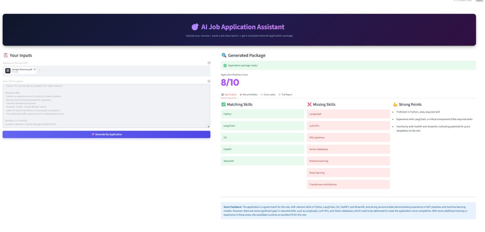
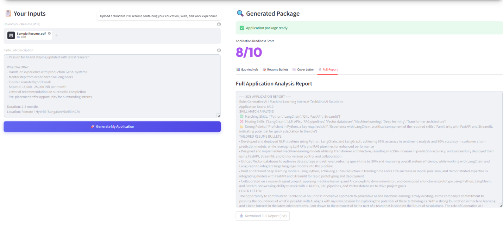

Here's an impressive, interactive-style README:

markdown# 🎯 Multi-Step Job Application Assistant

> *Stop spending hours tailoring applications. Let AI do it in 60 seconds.*

[](https://python.org)
[](https://github.com/langchain-ai/langgraph)
[](https://groq.com)
[](https://streamlit.io)

---

## 📸 Demo

<table>
  <tr>
    <td></td>
    <td></td>
  </tr>
  <tr>
    <td align="center"><b>Application Results</b></td>
    <td align="center"><b>Score Improvement Loop</b></td>
  </tr>
</table>

---

## 🤔 The Problem

Every internship/job application requires:
- ❌ Manually reading the entire JD
- ❌ Rewriting resume bullets for each role
- ❌ Writing a unique cover letter every time
- ❌ Guessing if your application is strong enough

**This agent does all of it automatically — and self-corrects until it's good enough.**

---

## ✨ What It Does
📄 Upload Resume PDF
+
📋 Paste Job Description
↓
🤖 AI Agent Runs
↓
📊 Skill Gap Analysis  →  ✅ Matching Skills
→  ❌ Missing Skills
→  💪 Strong Points
↓
✍️  5 Tailored Resume Bullets (with JD keywords)
↓
✉️  Personalized Cover Letter
↓
🎯 Application Score (1-10)
↓
Score < 7? → 🔄 Self-Corrects Automatically
Score ≥ 7? → 📥 Download Your Application

---

## 🔄 The Self-Correction Loop (The Impressive Part)

Most AI tools generate once and stop. This agent **scores its own output** and improves it.

| Attempt | What Happened |
|---------|--------------|
| 🔴 Attempt 1 | Generated bullets → Scored **6/10** → "Too generic, missing keywords" |
| 🟡 Retry | Read own feedback → Rewrote stronger bullets → New cover letter |
| 🟢 Attempt 2 | Rescored → **8/10** → Loop exits → Report compiled |

**Zero human intervention. The agent debugged itself.**

This is the [ReAct pattern](https://arxiv.org/abs/2210.03629) — Reason, Act, Observe, Reflect — implemented as a LangGraph cycle.

---

## 🏗️ Architecture
START
│
▼
┌─────────────────┐
│ extract_jd_info │  → company, role, skills, responsibilities
└────────┬────────┘
│
▼
┌─────────────────┐
│ analyze_resume  │  → candidate skills, experience summary
└────────┬────────┘
│
▼
┌─────────────────┐
│  gap_analysis   │  → matching skills, missing skills, strong points
└────────┬────────┘
│
▼
┌──────────────────┐ ◄──────────────────────┐
│ generate_bullets │   (retry with feedback) │
└────────┬─────────┘                         │
│                                   │
▼                                          │
┌───────────────────┐                        │
│ write_cover_letter│                        │
└────────┬──────────┘                        │
│                                   │
▼                                          │
┌───────────────────┐   score < 7            │
│ score_application │ ───────────────────────┘
└────────┬──────────┘
│ score ≥ 7
▼
┌────────────────┐
│ compile_report │  → complete application package
└────────┬───────┘
│
END

---

## 🛠️ Tech Stack

| Layer | Technology | Purpose |
|-------|-----------|---------|
| 🧠 Agent Brain | LangGraph StateGraph | Multi-node orchestration + retry loop |
| ⚡ LLM | Groq llama-3.3-70b-versatile | Fast inference for all nodes |
| 📄 PDF Reading | pdfplumber | Resume text extraction |
| 🎨 Frontend | Streamlit | Interactive UI + file downloads |
| 🔐 Secrets | python-dotenv | Secure API key management |

---

## 🚀 Quick Start

**1. Clone**
```bash
git clone https://github.com/kathpalsiya01-coder/job-application-assistant.git
cd job-application-assistant
```

**2. Setup environment**
```bash
conda create -n job_assistant python=3.10
conda activate job_assistant
pip install -r requirements.txt
```

**3. Add API key**
```bash
# Create .env file
echo "GROQ_API_KEY=your_key_here" > .env
```
Get your free key at [console.groq.com](https://console.groq.com)

**4. Run**
```bash
streamlit run app.py
```

Open `http://localhost:8501` 🚀

---

## 📖 How to Use
Step 1 → Upload your resume as PDF
Step 2 → Paste the job description
Step 3 → Click "Generate My Application"
Step 4 → Wait ~60 seconds
Step 5 → View results in 4 tabs
Step 6 → Download cover letter + report

---

## 📊 Real Test Results

Tested with a **GenAI Internship** job description:
✅ Matching Skills:  LangChain, LangGraph, Groq, RAG, Streamlit, FastAPI
❌ Missing Skills:   LoRA fine-tuning, Docker, RAGAS evaluation
💪 Strong Points:    3 agentic AI projects, RAG experience, fast learner
🔴 Round 1 Score:   6/10 — "bullets too generic"
🟢 Round 2 Score:   8/10 — self-corrected ✅

---

## 📁 Project Structure
job-application-assistant/
├── app.py           → Streamlit frontend (UI + tabs + downloads)
├── agent.py         → LangGraph graph + all 7 nodes
├── pdf_reader.py    → PDF text extraction utility
├── requirements.txt → Dependencies
├── .env             → API keys (not in repo)
└── .gitignore

---

## 🔬 Research Behind This

| Paper | Used For |
|-------|---------|
| [ReAct (Yao et al., 2022)](https://arxiv.org/abs/2210.03629) | Self-correction loop pattern |
| [Attention Is All You Need (Vaswani et al., 2017)](https://arxiv.org/abs/1706.03762) | Transformer powering the LLM |

---

## 🔮 Roadmap

- [ ] LinkedIn URL scraper — auto-fetch JD from link
- [ ] ATS score simulation
- [ ] Interview question generator from gaps
- [ ] Multi-resume comparison
- [ ] LangSmith tracing for observability
- [ ] Voice input for resume details

---

## 👩‍💻 Author

**Siya Kathal** — B.Tech student building GenAI + Agentic AI projects

[](https://github.com/kathpalsiya01-coder)
[](https://www.linkedin.com/in/siya-kathpal-640131333/)

---

<p align="center">⭐ Star this repo if you found it useful!</p>
